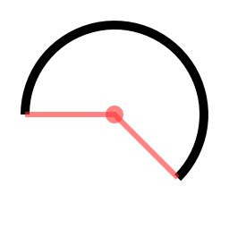
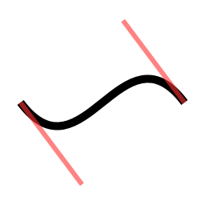
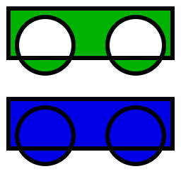
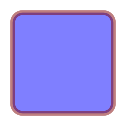

***
# libcg
The tiny `C` library of 2D computer graphics.

## Getting Started

The library's .c and .h files can be dropped into a project and compiled along with it.
Just type `make` at the root directory, you will see a  example binary file.

```shell
cd libcg
make
```
## Screenshots














## License

This library is free software; you can redistribute it and or modify it under the terms of the MIT license. See [MIT License](LICENSE) for details.

